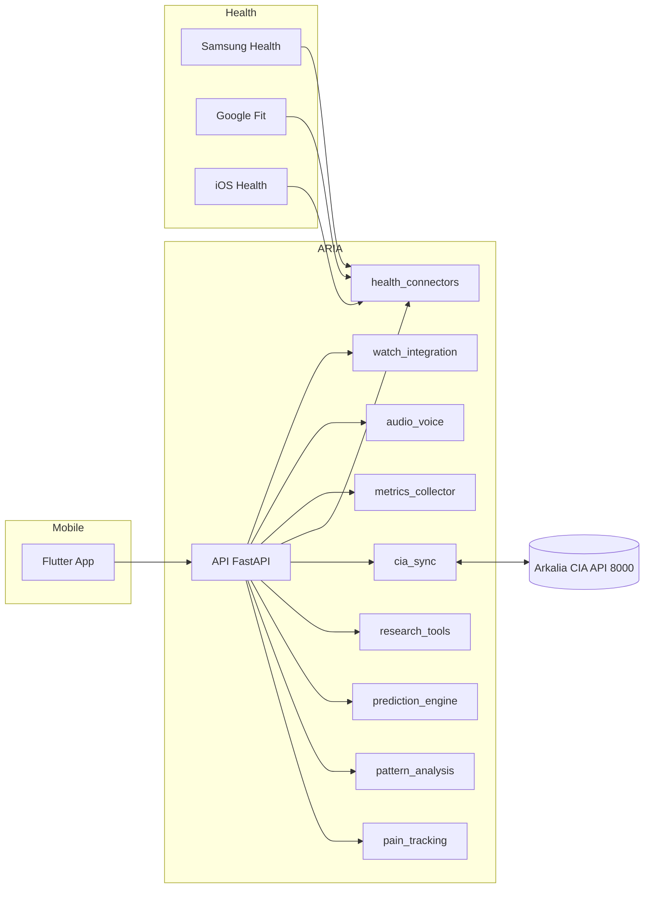

# 🧠❤️🔬 **ARKALIA ARIA** - Research Intelligence Assistant

**Assistant de Recherche Santé Personnelle - Laboratoire de données médicales 100% local**

---

<!-- Badges (sobres et factuels) -->
<p>
  <a href="https://github.com/arkalia-luna-system/arkalia-aria/actions/workflows/ci-cd.yml">
    
  </a>
  
  
  
  <a href="https://github.com/arkalia-luna-system/arkalia-aria/issues">
    
  </a>
</p>

---

## Liens utiles

- Documentation API: `docs/API_REFERENCE.md`
- Guide Utilisateur: `docs/USER_GUIDE.md`
- Guide Développeur: `docs/DEVELOPER_GUIDE.md`
- Statut Projet: `docs/PROJECT_STATUS.md`
- Connecteurs Santé: `docs/HEALTH_CONNECTORS.md`
- App Mobile: `docs/MOBILE_APP.md`
- Dashboard Web: `docs/DASHBOARD_WEB.md`
- Makefile: `Makefile`

---

## 🎯 **Vision**

ARKALIA ARIA (Arkalia Research Intelligence Assistant) est un laboratoire personnel de recherche santé qui transforme tes données médicales en insights actionables, tout en gardant un contrôle total sur tes informations sensibles.

**Philosophie** : Tes données médicales te appartiennent. ARIA travaille exclusivement pour toi, localement, sans jamais partager tes informations sans ton consentement explicite.

---

## 🏗️ **Architecture Modulaire**

```
arkalia-aria/
├── pain_tracking/     # Module tracking douleur avancé
├── pattern_analysis/   # IA découverte de patterns
├── prediction_engine/ # Anticiper les crises
├── health_connectors/ # Connecteurs Samsung/Google/iOS Health
├── metrics_collector/ # Dashboard web interactif et métriques
├── mobile_app/        # Application Flutter native complète
├── research_tools/    # Laboratoire personnel
├── cia_sync/         # Sync avec CIA si besoin
├── audio_voice/      # Interface vocale
├── watch_integration/ # Intégration montres connectées
└── docs/             # Documentation complète
```

Diagramme d'architecture (simplifié)



---

## 🔬 **Modules**

### 📊 **Pain Tracking** ✅ **OPÉRATIONNEL**
- Saisie ultra-rapide (3 questions) - API testée et fonctionnelle
- Historique complet avec filtres - Endpoint `/api/pain/entries/recent`
- Export pour professionnels de santé
- Intégration capteurs (optionnel)
- **Modèles corrigés** : `physical_trigger` et `action_taken`

### 🏥 **Health Connectors** ✅ **OPÉRATIONNEL**
- **Samsung Health** : Synchronisation montres Samsung
- **Google Fit** : Intégration Android (S24)
- **iOS Health** : Connexion iPad Apple Health
- **API FastAPI** : 16 endpoints santé complets
- **Sync Manager** : Gestionnaire de synchronisation unifié
- **Data Models** : Modèles de données standardisés

### 📱 **Mobile App Flutter** 🚧 **EN DÉVELOPPEMENT**
- **Architecture modulaire** : Services et modèles de données
- **Services implémentés** : Notifications, Cache offline, API
- **Configuration** : Support Android et iOS
- **Fonctionnalités prévues** : Interface complète, synchronisation bidirectionnelle

### 🌐 **Dashboard Web** ✅ **OPÉRATIONNEL**
- **6 templates HTML** : Dashboard, santé, métriques, analytics, patterns, rapports
- **Graphiques interactifs** : Chart.js temps réel
- **Exports multiples** : PDF, Excel, HTML
- **Interface responsive** : Design moderne et intuitif
- **Analyses avancées** : Patterns et corrélations

### 🧠 **Pattern Analysis** 
- Détection automatique de corrélations
- Analyse temporelle des crises
- Identification des déclencheurs
- Rapports visuels interactifs

### 🔮 **Prediction Engine**
- Modèles ML locaux (Ollama)
- Alertes préventives
- Recommandations personnalisées
- Apprentissage continu

### 📊 **Dashboard Web Interactif** ✅ **NOUVEAU**
- **Métriques santé** : Visualisation temps réel
- **Analyse douleur** : Patterns et corrélations
- **Graphiques interactifs** : Chart.js/D3.js
- **Exports avancés** : PDF, Excel, HTML
- **Aperçu rapports** : Prévisualisation
- **Interface responsive** : Desktop et mobile

### 🧪 **Research Tools**
- Laboratoire de données
- Expérimentations contrôlées
- Métriques de santé avancées
- Export anonymisé (optionnel)

### 🔗 **CIA Sync**
- Synchronisation optionnelle avec CIA
- Partage sélectif de données
- Mode "Psy Presentation"
- Contrôle granulaire des permissions

---

## 🚀 **Getting Started**

```bash
# Installation
git clone https://github.com/arkalia-luna-system/arkalia-aria.git
cd arkalia-aria
pip install -r requirements.txt

# Lancement
python main.py
```

### 🧹 Maintenance rapide

```bash
# Nettoyer caches Python et rapports
make clean-cache

# Supprimer fichiers cachés macOS (._*, .DS_Store)
make clean-macos

# Vérification santé du workspace (disque, processus, fichiers cachés)
make workspace-health
```

---

## 🔒 **Sécurité & Confidentialité**

- Local: les données sont stockées en local (SQLite). Pas de transmission externe par défaut.
- Authentification: non activée en mode développement local.
- Partage: synchronisation CIA optionnelle, à l’initiative de l’utilisateur.
- Export: CSV et rapports possibles; anonymisation à réaliser côté utilisateur si nécessaire.
- Variables d’environnement: voir `docs/USER_GUIDE.md` (valeurs par défaut incluses).

---

## 🌐 **Écosystème Arkalia Luna System**

| Projet | Relation | Description |
|--------|----------|-------------|
| **Arkalia CIA** | Complémentaire | Santé quotidienne basique |
| **Arkalia Quest** | Gamification | Système de récompenses |
| **BBIA Reachy Sim** | IA Émotionnelle | Analyse émotionnelle |
| **Arkalia Metrics** | Monitoring | Métriques système |

---

## 📈 **Roadmap**

- [x] Phase 1: Structure modulaire
- [x] Phase 2: Pain tracking (endpoints principaux)
- [x] Phase 3: Health connectors (Samsung/Google/iOS) ✅ **TERMINÉ**
- [x] Phase 4: Dashboard web interactif ✅ **TERMINÉ**
- [x] Phase 5: Application mobile Flutter (architecture) 🚧 **EN DÉVELOPPEMENT**
- [x] Phase 6: Tests unitaires complets ✅ **TERMINÉ**
- [x] Phase 7: Documentation complète ✅ **TERMINÉ**
- [ ] Phase 8: Pattern analysis (itératif)
- [ ] Phase 9: Prediction engine (améliorations)
- [ ] Phase 10: Research tools (laboratoire)
- [ ] Phase 11: Intégrations écosystème avancées

---

## 🤝 **Contribution**

Ce projet fait partie de l'écosystème Arkalia Luna System. Les contributions sont les bienvenues !

- 🐛 **Issues** : Signaler des bugs
- 💡 **Feature Requests** : Proposer des améliorations  
- 📖 **Documentation** : Améliorer la doc
- 🧪 **Testing** : Tester et valider

---

## 📞 **Contact**

- **GitHub** : [arkalia-luna-system](https://github.com/arkalia-luna-system)
- **Issues** : [Ouvrir une issue](https://github.com/arkalia-luna-system/arkalia-aria/issues)

---

> **"Tes données médicales sont sacrées. ARIA les protège comme un trésor personnel."**
