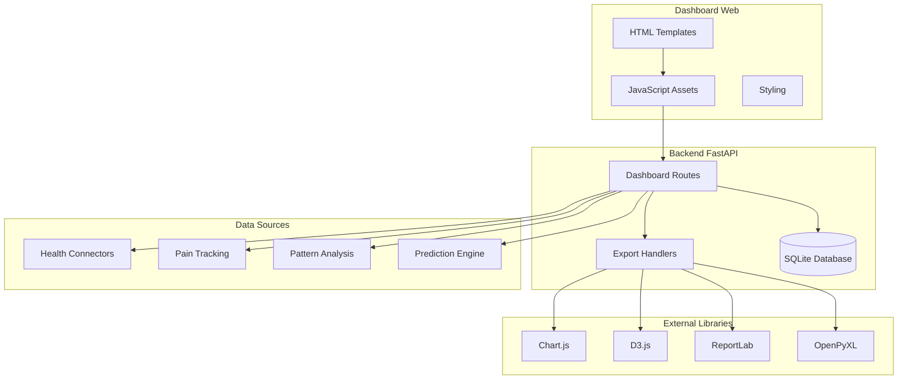

# 📊 **ARKALIA ARIA - Dashboard Web Interactif**

**Interface Web Avancée pour la Visualisation et l'Analyse des Données de Santé**

---

## 📋 **Vue d'ensemble**

Le dashboard web ARKALIA ARIA offre une interface web interactive et responsive pour visualiser, analyser et exporter vos données de santé avec des graphiques en temps réel et des fonctionnalités d'export avancées.

### 🎯 **Objectifs**

- **Visualisation temps réel** : Graphiques interactifs et dynamiques
- **Analyses avancées** : Patterns, corrélations et tendances
- **Exports multiples** : PDF, Excel, HTML avec personnalisation
- **Interface responsive** : Optimisé desktop et mobile
- **Intégration complète** : Synchronisation avec tous les modules ARIA

---

## 🏗️ **Architecture**

### **Structure des Fichiers**

```
metrics_collector/dashboard/
├── templates/                     # Templates HTML
│   ├── dashboard.html            # Dashboard principal
│   ├── health_metrics.html       # Métriques santé
│   ├── pain_analytics.html       # Analyse douleur
│   ├── patterns_visualization.html # Visualisation patterns
│   ├── reports.html              # Génération rapports
│   └── metrics.html              # Métriques générales
├── static/                       # Assets statiques
│   ├── charts.js                 # Graphiques Chart.js/D3.js
│   ├── realtime.js               # Mise à jour temps réel
│   └── exports.js                # Fonctionnalités d'export
├── aria_metrics_dashboard.py     # Extension du dashboard
└── export_handlers.py            # Gestionnaires d'export
```

### **Diagramme d'Architecture**



---

## 📱 **Pages du Dashboard**

### **🏠 Dashboard Principal**

**Route** : `/dashboard`

**Fonctionnalités** :
- Vue d'ensemble des métriques ARIA
- Accès rapide aux fonctionnalités principales
- Métriques de sécurité et performance
- Actions rapides

### **📊 Métriques Générales**

**Route** : `/dashboard/metrics`

**Fonctionnalités** :
- Métriques système générales
- Performance de l'application
- Statistiques d'utilisation

### **🔒 Sécurité**

**Route** : `/dashboard/security`

**Fonctionnalités** :
- Métriques de sécurité
- Alertes de sécurité
- Audit des accès

### **⚡ Performance**

**Route** : `/dashboard/performance`

**Fonctionnalités** :
- Métriques de performance
- Temps de réponse
- Utilisation des ressources

### **🏥 Métriques Santé**

**Route** : `/dashboard/health`

**Fonctionnalités** :
- Visualisation détaillée des données de santé
- Graphiques interactifs par connecteur
- Comparaisons temporelles
- Export des données brutes

**Visualisations** :
- **Graphique de fréquence cardiaque** : Évolution temporelle
- **Graphique de pression artérielle** : Systolique/Diastolique
- **Graphique de poids/BMI** : Suivi corporel
- **Graphique de température** : Variations corporelles

### **💔 Analyse Douleur**

**Route** : `/dashboard/pain`

**Fonctionnalités** :
- Analyse approfondie des patterns de douleur
- Identification des déclencheurs
- Corrélations avec autres métriques
- Recommandations personnalisées

**Analyses** :
- **Heatmap de douleur** : Intensité par heure/jour
- **Graphique des déclencheurs** : Fréquence des causes
- **Graphique des localisations** : Zones affectées
- **Graphique d'efficacité** : Actions et résultats

### **🔍 Visualisation Patterns**

**Route** : `/dashboard/patterns`

**Fonctionnalités** :
- Découverte automatique de patterns
- Corrélations entre métriques
- Prédictions basées sur l'historique
- Visualisations avancées

**Patterns Détectés** :
- **Corrélations temporelles** : Douleur vs activité
- **Patterns cycliques** : Cycles de sommeil/douleur
- **Tendances saisonnières** : Variations long terme
- **Anomalies** : Détection d'événements inhabituels

### **📄 Génération Rapports**

**Route** : `/dashboard/reports`

**Fonctionnalités** :
- Création de rapports personnalisés
- Aperçu en temps réel
- Export multiple (PDF, Excel, HTML)
- Templates prédéfinis

**Types de Rapports** :
- **Rapport hebdomadaire** : Résumé 7 jours
- **Rapport mensuel** : Analyse complète du mois
- **Rapport médical** : Pour professionnels de santé
- **Rapport personnalisé** : Configuration libre

---

## 🔧 **Fonctionnalités Techniques**

### **Graphiques Interactifs**

**Fichier** : `static/charts.js`

**Technologies** :
- **Chart.js** : Graphiques de base (lignes, barres, secteurs)
- **D3.js** : Visualisations avancées et personnalisées
- **Real-time updates** : Mise à jour automatique des données

**Types de Graphiques** :
```javascript
// Graphique de tendances
const trendChart = new Chart(ctx, {
  type: 'line',
  data: {
    labels: timeLabels,
    datasets: [{
      label: 'Douleur',
      data: painData,
      borderColor: 'rgb(255, 99, 132)',
      tension: 0.1
    }]
  },
  options: {
    responsive: true,
    scales: {
      y: {
        beginAtZero: true,
        max: 10
      }
    }
  }
});
```

### **Mise à Jour Temps Réel**

**Fichier** : `static/realtime.js`

**Fonctionnalités** :
- WebSocket pour mises à jour instantanées
- Polling automatique des nouvelles données
- Cache intelligent pour optimiser les performances
- Gestion des erreurs de connexion

**Implémentation** :
```javascript
class RealtimeUpdater {
  constructor() {
    this.ws = new WebSocket('ws://localhost:8000/ws');
    this.pollInterval = 30000; // 30 secondes
    this.cache = new Map();
  }
  
  startPolling() {
    setInterval(() => {
      this.fetchLatestData();
    }, this.pollInterval);
  }
  
  async fetchLatestData() {
    try {
      const response = await fetch('/api/health/metrics/latest');
      const data = await response.json();
      this.updateCharts(data);
    } catch (error) {
      console.error('Erreur mise à jour:', error);
    }
  }
}
```

### **Système d'Export**

**Fichier** : `static/exports.js`

**Fonctionnalités** :
- Export PDF avec graphiques intégrés
- Export Excel avec données structurées
- Export HTML avec interactivité
- Aperçu avant export

**Types d'Export** :
```javascript
class ExportManager {
  async exportPDF(data, options) {
    const response = await fetch('/dashboard/export/pdf', {
      method: 'POST',
      headers: {
        'Content-Type': 'application/json',
      },
      body: JSON.stringify({
        data: data,
        options: options,
        includeCharts: true,
        includeSummary: true
      })
    });
    
    const blob = await response.blob();
    this.downloadFile(blob, 'rapport-aria.pdf');
  }
  
  async exportExcel(data, options) {
    // Export Excel avec données structurées
  }
  
  async exportHTML(data, options) {
    // Export HTML avec interactivité préservée
  }
}
```

---

## 📊 **Gestionnaires d'Export**

### **PDFExportHandler**

**Fichier** : `export_handlers.py`

**Fonctionnalités** :
- Génération PDF avec ReportLab
- Intégration de graphiques
- Mise en page professionnelle
- Métadonnées et filigranes

**Implémentation** :
```python
class PDFExportHandler:
    async def export(self, request: Request):
        data = await request.json()
        
        # Créer le PDF
        buffer = BytesIO()
        doc = SimpleDocTemplate(buffer, pagesize=A4)
        
        # Contenu du rapport
        story = []
        story.append(Paragraph("Rapport ARKALIA ARIA", styles['Title']))
        
        # Ajouter les graphiques
        if data.get('includeCharts'):
            story.extend(self._add_charts(data))
        
        # Ajouter le résumé
        if data.get('includeSummary'):
            story.extend(self._add_summary(data))
        
        # Générer le PDF
        doc.build(story)
        buffer.seek(0)
        
        return StreamingResponse(
            BytesIO(buffer.getvalue()),
            media_type="application/pdf",
            headers={"Content-Disposition": "attachment; filename=rapport-aria.pdf"}
        )
```

### **ExcelExportHandler**

**Fonctionnalités** :
- Génération Excel avec OpenPyXL
- Feuilles multiples par type de données
- Formatage conditionnel
- Graphiques intégrés

### **HTMLExportHandler**

**Fonctionnalités** :
- Export HTML avec interactivité
- CSS et JavaScript intégrés
- Responsive design
- Compatible tous navigateurs

### **ReportPreviewHandler**

**Fonctionnalités** :
- Aperçu avant export
- Personnalisation en temps réel
- Validation des données
- Estimation de la taille

---

## 🚀 **API Endpoints**

### **Routes Dashboard**

```python
# Métriques santé
@app.get("/dashboard/health", response_class=HTMLResponse)
async def dashboard_health(request: Request):
    """Page des métriques de santé."""
    return templates.TemplateResponse(
        "health_metrics.html", 
        {"request": request, "title": "Métriques Santé ARIA"}
    )

# Analyse douleur
@app.get("/dashboard/pain", response_class=HTMLResponse)
async def dashboard_pain(request: Request):
    """Page d'analyse de la douleur."""
    return templates.TemplateResponse(
        "pain_analytics.html", 
        {"request": request, "title": "Analyse Douleur ARIA"}
    )

# Visualisation patterns
@app.get("/dashboard/patterns", response_class=HTMLResponse)
async def dashboard_patterns(request: Request):
    """Page de visualisation des patterns."""
    return templates.TemplateResponse(
        "patterns_visualization.html", 
        {"request": request, "title": "Patterns ARIA"}
    )

# Génération rapports
@app.get("/dashboard/reports", response_class=HTMLResponse)
async def dashboard_reports(request: Request):
    """Page de génération de rapports."""
    return templates.TemplateResponse(
        "reports.html", 
        {"request": request, "title": "Rapports ARIA"}
    )
```

### **Routes d'Export**

```python
# Export PDF
@app.post("/dashboard/export/pdf")
async def export_pdf(request: Request):
    """Export PDF des données."""
    try:
        handler = PDFExportHandler()
        return await handler.export(request)
    except Exception as e:
        raise HTTPException(status_code=500, detail=f"Erreur export PDF: {str(e)}")

# Export Excel
@app.post("/dashboard/export/excel")
async def export_excel(request: Request):
    """Export Excel des données."""
    try:
        handler = ExcelExportHandler()
        return await handler.export(request)
    except Exception as e:
        raise HTTPException(status_code=500, detail=f"Erreur export Excel: {str(e)}")

# Export HTML
@app.post("/dashboard/export/html")
async def export_html(request: Request):
    """Export HTML des données."""
    try:
        handler = HTMLExportHandler()
        return await handler.export(request)
    except Exception as e:
        raise HTTPException(status_code=500, detail=f"Erreur export HTML: {str(e)}")

# Aperçu rapport
@app.post("/dashboard/preview")
async def preview_report(request: Request):
    """Aperçu d'un rapport."""
    try:
        handler = ReportPreviewHandler()
        return await handler.preview(request)
    except Exception as e:
        raise HTTPException(status_code=500, detail=f"Erreur aperçu: {str(e)}")
```

---

## 🎨 **Interface Utilisateur**

### **Design System**

**Couleurs** :
- **Primaire** : Rouge ARKALIA (#DC2626)
- **Secondaire** : Bleu santé (#2563EB)
- **Succès** : Vert (#059669)
- **Attention** : Orange (#D97706)
- **Erreur** : Rouge (#DC2626)

**Typographie** :
- **Titres** : Inter, 24px, Bold
- **Sous-titres** : Inter, 18px, SemiBold
- **Corps** : Inter, 14px, Regular
- **Captions** : Inter, 12px, Regular

### **Composants Réutilisables**

```html
<!-- Carte de métrique -->
<div class="metric-card">
  <div class="metric-icon">
    <i class="fas fa-heartbeat"></i>
  </div>
  <div class="metric-content">
    <div class="metric-value">72</div>
    <div class="metric-label">BPM</div>
    <div class="metric-trend">
      <i class="fas fa-arrow-up trend-up"></i>
      <span>+2%</span>
    </div>
  </div>
</div>

<!-- Graphique interactif -->
<div class="chart-container">
  <canvas id="healthChart"></canvas>
  <div class="chart-controls">
    <button class="btn btn-sm" onclick="toggleChartType()">
      <i class="fas fa-chart-line"></i>
    </button>
    <button class="btn btn-sm" onclick="exportChart()">
      <i class="fas fa-download"></i>
    </button>
  </div>
</div>
```

### **Responsive Design**

```css
/* Mobile First */
.dashboard-grid {
  display: grid;
  grid-template-columns: 1fr;
  gap: 1rem;
}

/* Tablet */
@media (min-width: 768px) {
  .dashboard-grid {
    grid-template-columns: repeat(2, 1fr);
  }
}

/* Desktop */
@media (min-width: 1024px) {
  .dashboard-grid {
    grid-template-columns: repeat(3, 1fr);
  }
}
```

---

## 🔒 **Sécurité et Performance**

### **Sécurité**

- **Authentification** : JWT tokens pour l'API
- **Autorisation** : Contrôle d'accès granulaire
- **Validation** : Sanitisation des données d'entrée
- **HTTPS** : Chiffrement des communications

### **Performance**

- **Cache** : Mise en cache des données fréquentes
- **Lazy Loading** : Chargement différé des graphiques
- **Compression** : Gzip pour les assets statiques
- **CDN** : Distribution des ressources statiques

### **Optimisations**

```javascript
// Lazy loading des graphiques
const observer = new IntersectionObserver((entries) => {
  entries.forEach(entry => {
    if (entry.isIntersecting) {
      loadChart(entry.target);
    }
  });
});

// Cache des données
class DataCache {
  constructor(ttl = 300000) { // 5 minutes
    this.cache = new Map();
    this.ttl = ttl;
  }
  
  get(key) {
    const item = this.cache.get(key);
    if (item && Date.now() - item.timestamp < this.ttl) {
      return item.data;
    }
    return null;
  }
  
  set(key, data) {
    this.cache.set(key, {
      data: data,
      timestamp: Date.now()
    });
  }
}
```

---

## 🧪 **Tests**

### **Tests Frontend**

```javascript
// Tests des graphiques
describe('Chart Rendering', () => {
  test('should render pain trend chart', () => {
    const chart = new PainTrendChart('test-canvas');
    expect(chart.isRendered()).toBe(true);
  });
  
  test('should update chart with new data', () => {
    const chart = new PainTrendChart('test-canvas');
    const newData = generateMockData();
    chart.updateData(newData);
    expect(chart.getData()).toEqual(newData);
  });
});

// Tests des exports
describe('Export Functionality', () => {
  test('should export PDF successfully', async () => {
    const exportManager = new ExportManager();
    const result = await exportManager.exportPDF(mockData);
    expect(result.success).toBe(true);
  });
});
```

### **Tests Backend**

```python
# Tests des routes dashboard
def test_dashboard_health():
    response = client.get("/dashboard/health")
    assert response.status_code == 200
    assert "Métriques Santé ARIA" in response.text

# Tests des exports
def test_export_pdf():
    response = client.post("/dashboard/export/pdf", json=mock_export_data)
    assert response.status_code == 200
    assert response.headers["content-type"] == "application/pdf"
```

---

## 📈 **Monitoring et Analytics**

### **Métriques de Performance**

- **Temps de chargement** : < 2 secondes
- **Temps de rendu** : < 500ms
- **Taux d'erreur** : < 1%
- **Disponibilité** : > 99.9%

### **Analytics Utilisateur**

- **Pages les plus visitées** : Dashboard, Analyses, Rapports
- **Fonctionnalités utilisées** : Exports, Filtres, Graphiques
- **Temps de session** : Moyenne et médiane
- **Taux de conversion** : Export/Visualisation

---

## 🐛 **Dépannage**

### **Problèmes Courants**

1. **Graphiques ne se chargent pas** :
   - Vérifier la console JavaScript
   - Contrôler les données API
   - Vérifier les permissions CORS

2. **Export échoue** :
   - Vérifier les données d'entrée
   - Contrôler l'espace disque
   - Vérifier les permissions de fichier

3. **Performance lente** :
   - Activer le cache
   - Optimiser les requêtes
   - Réduire la taille des datasets

### **Logs et Debug**

```python
# Activation des logs détaillés
import logging
logging.basicConfig(level=logging.DEBUG)
logger = logging.getLogger("dashboard")

# Logs des exports
logger.info(f"Export PDF démarré: {user_id}")
logger.error(f"Erreur export: {error}")
```

---

## 🔮 **Évolutions Futures**

### **Fonctionnalités Avancées**

- **IA Intégrée** : Recommandations automatiques
- **Real-time Collaboration** : Partage en temps réel
- **Advanced Analytics** : Machine Learning intégré
- **Custom Dashboards** : Personnalisation complète

### **Améliorations Techniques**

- **Progressive Web App** : Installation native
- **Offline Support** : Fonctionnement hors ligne
- **Voice Control** : Commandes vocales
- **AR/VR** : Visualisation immersive

---

## 📞 **Support**

- **Documentation** : `docs/DASHBOARD_WEB.md`
- **Issues** : [GitHub Issues](https://github.com/arkalia-luna-system/arkalia-aria/issues)
- **Demo** : [Dashboard Live](https://aria.arkalia.com/dashboard)

---

> **"Visualisez votre santé comme jamais auparavant. Le dashboard ARIA transforme vos données en insights actionables."**
