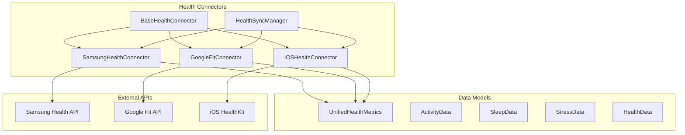

# 🏥 **ARKALIA ARIA - Health Connectors**

**Connecteurs Santé pour Intégration Multi-Plateforme**

---

## 📋 **Vue d'ensemble**

Les connecteurs santé d'ARKALIA ARIA permettent la synchronisation des données de santé depuis différentes plateformes et appareils, offrant une vue unifiée de votre santé.

### 🎯 **Objectifs**

- **Unification** : Données de santé centralisées
- **Synchronisation** : Mise à jour automatique
- **Sécurité** : Stockage local uniquement
- **Flexibilité** : Support multi-plateforme

---

## 🔌 **Connecteurs Disponibles**

### 📱 **Samsung Health**
- **Appareil** : Montres Samsung (Galaxy Watch)
- **Données** : Activité, sommeil, fréquence cardiaque
- **API** : Samsung Health SDK
- **Statut** : ✅ Implémenté

### 🤖 **Google Fit**
- **Appareil** : Android (S24)
- **Données** : Activité, calories, distance
- **API** : Google Fit API
- **Statut** : ✅ Implémenté

### 🍎 **iOS Health**
- **Appareil** : iPad
- **Données** : Santé, activité, sommeil
- **API** : HealthKit
- **Statut** : ✅ Implémenté

---

## 🏗️ **Architecture**

### Structure des Fichiers

```
health_connectors/
├── __init__.py                    # Initialisation du module
├── base_connector.py              # Classe de base abstraite
├── data_models.py                 # Modèles de données unifiés
├── samsung_health_connector.py    # Connecteur Samsung Health
├── google_fit_connector.py        # Connecteur Google Fit
├── ios_health_connector.py        # Connecteur iOS Health
├── sync_manager.py                # Gestionnaire de synchronisation
└── api.py                         # Endpoints API FastAPI
```

### Diagramme d'Architecture



---

## 📊 **Modèles de Données**

### UnifiedHealthMetrics

```python
class UnifiedHealthMetrics(BaseModel):
    """Métriques de santé unifiées"""
    timestamp: datetime
    total_steps: int
    total_calories: float
    distance: float
    sleep_duration: float
    sleep_quality: float
    stress_level: float
    heart_rate: float
    blood_pressure_systolic: Optional[int]
    blood_pressure_diastolic: Optional[int]
    weight: Optional[float]
    bmi: Optional[float]
```

### ActivityData

```python
class ActivityData(BaseModel):
    """Données d'activité physique"""
    timestamp: datetime
    steps: int
    calories: float
    distance: float
    active_minutes: int
    activity_type: str
    intensity: str
```

### SleepData

```python
class SleepData(BaseModel):
    """Données de sommeil"""
    timestamp: datetime
    duration: float
    quality: float
    deep_sleep: float
    light_sleep: float
    rem_sleep: float
    awakenings: int
```

### StressData

```python
class StressData(BaseModel):
    """Données de stress"""
    timestamp: datetime
    level: float
    heart_rate: float
    hrv: Optional[float]
    stress_events: List[str]
```

### HealthData

```python
class HealthData(BaseModel):
    """Données de santé générales"""
    timestamp: datetime
    heart_rate: float
    blood_pressure_systolic: Optional[int]
    blood_pressure_diastolic: Optional[int]
    weight: Optional[float]
    bmi: Optional[float]
    body_fat: Optional[float]
    temperature: Optional[float]
```

---

## 🔧 **API Endpoints**

### Synchronisation

```http
POST /health/samsung/sync
POST /health/google/sync
POST /health/ios/sync
POST /health/sync/all
Content-Type: application/json

{
  "days_back": 30,
  "connector_name": "samsung_health"
}
```

### Récupération des Données

```http
GET /health/data/activity?days_back=30
GET /health/data/sleep?days_back=30
GET /health/data/stress?days_back=30
GET /health/data/health?days_back=30
GET /health/metrics/unified?days_back=30
```

### Statut des Connecteurs

```http
GET /health/connectors/status
```

### Configuration

```http
GET /health/config
PUT /health/config
```

**Réponse :**

```json
{
  "timestamp": "2024-01-15T10:30:00Z",
  "connectors": {
    "samsung_health": {
      "status": "connected",
      "last_sync": "2024-01-15T09:00:00Z",
      "data_count": 150
    },
    "google_fit": {
      "status": "connected",
      "last_sync": "2024-01-15T09:15:00Z",
      "data_count": 200
    },
    "ios_health": {
      "status": "disconnected",
      "last_sync": null,
      "data_count": 0
    }
  },
  "total_connectors": 3,
  "connected_connectors": 2,
  "total_data_synced": 350,
  "global_errors": [],
  "overall_status": "partial"
}
```

---

## 🚀 **Utilisation**

### Configuration

1. **Samsung Health** :
   ```python
   connector = SamsungHealthConnector()
   await connector.connect()
   ```

2. **Google Fit** :
   ```python
   connector = GoogleFitConnector()
   await connector.connect()
   ```

3. **iOS Health** :
   ```python
   connector = IOSHealthConnector()
   await connector.connect()
   ```

### Synchronisation

```python
from health_connectors import HealthSyncManager

# Créer le gestionnaire de synchronisation
sync_manager = HealthSyncManager()

# Synchroniser tous les connecteurs
await sync_manager.sync_all_connectors(days_back=7)

# Synchroniser un connecteur spécifique
await sync_manager.sync_connector("samsung_health", days_back=7)
```

### Récupération des Données

```python
# Métriques unifiées
metrics = await sync_manager.get_unified_metrics(days_back=7)

# Données spécifiques
activity_data = await sync_manager.get_activity_data(days_back=7)
sleep_data = await sync_manager.get_sleep_data(days_back=7)
stress_data = await sync_manager.get_stress_data(days_back=7)
health_data = await sync_manager.get_health_data(days_back=7)
```

---

## 🔒 **Sécurité et Confidentialité**

### Stockage Local

- Toutes les données sont stockées localement
- Aucune transmission externe par défaut
- Chiffrement des données sensibles

### Authentification

- Tokens OAuth2 pour chaque connecteur
- Stockage sécurisé des credentials
- Renouvellement automatique des tokens

### Permissions

- Contrôle granulaire des permissions
- Consentement explicite requis
- Possibilité de désactiver chaque connecteur

---

## 🧪 **Tests**

### Tests Unitaires

```bash
# Tests des connecteurs
python -m pytest tests/test_health_connectors.py

# Tests des modèles de données
python -m pytest tests/test_data_models.py

# Tests de l'API
python -m pytest tests/test_health_api.py
```

### Tests d'Intégration

```bash
# Test de synchronisation complète
python -m pytest tests/test_integration.py
```

---

## 📈 **Monitoring et Logs**

### Logs de Synchronisation

```python
import logging

# Configuration des logs
logging.basicConfig(level=logging.INFO)
logger = logging.getLogger("health_connectors")

# Logs automatiques lors de la synchronisation
await sync_manager.sync_all_connectors()
```

### Métriques de Performance

- Temps de synchronisation
- Nombre de données synchronisées
- Taux d'erreur par connecteur
- Latence des API externes

---

## 🐛 **Dépannage**

### Problèmes Courants

1. **Connecteur non connecté** :
   - Vérifier les credentials
   - Renouveler les tokens OAuth2
   - Vérifier les permissions

2. **Données manquantes** :
   - Vérifier la période de synchronisation
   - Contrôler les permissions de l'appareil
   - Vérifier la connectivité réseau

3. **Erreurs de synchronisation** :
   - Consulter les logs détaillés
   - Vérifier la stabilité de l'API externe
   - Tester la connectivité

### Support

- **Documentation** : `docs/HEALTH_CONNECTORS.md`
- **Issues** : [GitHub Issues](https://github.com/arkalia-luna-system/arkalia-aria/issues)
- **Logs** : Vérifier les logs de l'application

---

## 🔮 **Évolutions Futures**

### Connecteurs Additionnels

- **Fitbit** : Montres et trackers Fitbit
- **Garmin** : Montres Garmin
- **Withings** : Balances et trackers Withings
- **Polar** : Montres Polar

### Fonctionnalités Avancées

- Synchronisation en temps réel
- Détection automatique des appareils
- Recommandations personnalisées
- Intégration IA pour l'analyse

---

> **"Vos données de santé sont précieuses. Les connecteurs ARIA les protègent et les unifient pour votre bien-être."**
