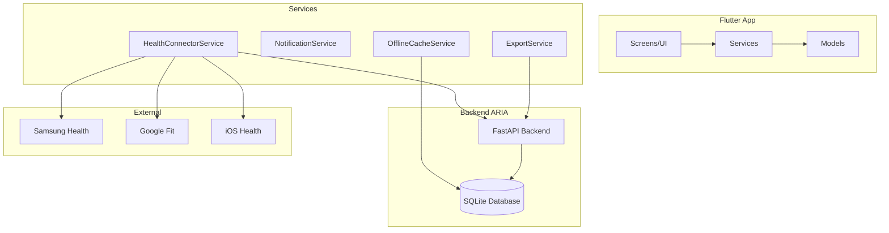

# 📱 **ARKALIA ARIA - Application Mobile Flutter**

**Application Mobile Native pour la Gestion de Santé Personnelle**

---

## 📋 **Vue d'ensemble**

L'application mobile ARKALIA ARIA est une application Flutter native qui offre une interface intuitive et complète pour la gestion de votre santé personnelle, avec synchronisation bidirectionnelle et mode hors ligne.

### 🎯 **Objectifs**

- **Interface intuitive** : Design moderne et accessible
- **Synchronisation bidirectionnelle** : Données en temps réel
- **Mode hors ligne** : Fonctionnement sans connexion
- **Notifications intelligentes** : Rappels et alertes personnalisées
- **Rapports avancés** : Export PDF/Excel/HTML

---

## 🏗️ **Architecture**

### **Structure des Fichiers**

```
mobile_app/
├── lib/
│   ├── models/                    # Modèles de données
│   │   ├── health_data.dart
│   │   ├── pain_entry.dart
│   │   ├── analytics_data.dart
│   │   └── sync_status.dart
│   ├── services/                  # Services métier
│   │   ├── health_connector_service.dart
│   │   ├── notification_service.dart
│   │   ├── offline_cache_service.dart
│   │   └── export_service.dart
│   ├── screens/                   # Écrans de l'application
│   │   ├── health_sync_screen.dart
│   │   ├── dashboard_screen.dart
│   │   ├── analytics_screen.dart
│   │   ├── settings_screen.dart
│   │   ├── notifications_screen.dart
│   │   └── reports_screen.dart
│   └── main.dart                  # Point d'entrée
├── android/                       # Configuration Android
├── ios/                          # Configuration iOS
└── pubspec.yaml                  # Dépendances Flutter
```

### **Diagramme d'Architecture**



---

## 📱 **Écrans de l'Application**

### **🏠 Dashboard Principal**

**Fichier** : `lib/screens/dashboard_screen.dart`

**Fonctionnalités** :
- Vue d'ensemble des métriques santé
- Accès rapide aux fonctionnalités principales
- Synchronisation en temps réel
- Actions rapides (ajouter douleur, synchroniser)

**Composants** :
- Carte de bienvenue personnalisée
- Grille des métriques santé (pas, calories, distance, sommeil)
- Liste des douleurs récentes
- Actions rapides (analyses, rapports, paramètres)
- Statut de synchronisation

### **🔄 Synchronisation Santé**

**Fichier** : `lib/screens/health_sync_screen.dart`

**Fonctionnalités** :
- Gestion des connecteurs santé
- Synchronisation manuelle et automatique
- Statut de connexion en temps réel
- Historique des synchronisations

**Connecteurs** :
- Samsung Health (montres Samsung)
- Google Fit (Android S24)
- iOS Health (iPad)

### **📊 Analyses Avancées**

**Fichier** : `lib/screens/analytics_screen.dart`

**Fonctionnalités** :
- Analyses de douleur avec tendances
- Visualisations d'activité physique
- Analyses de sommeil et stress
- Filtres temporels personnalisables

**Onglets** :
- **Douleur** : Tendances, déclencheurs, localisations
- **Activité** : Pas, calories, distance
- **Sommeil** : Durée, qualité, patterns
- **Stress** : Niveaux, fréquence cardiaque

### **⚙️ Paramètres**

**Fichier** : `lib/screens/settings_screen.dart`

**Fonctionnalités** :
- Configuration des notifications
- Paramètres de synchronisation
- Préférences d'apparence
- Gestion des données et cache

**Sections** :
- **Notifications** : Activation, test
- **Synchronisation** : Intervalle, mode automatique
- **Apparence** : Langue, thème
- **Données** : Cache, export, suppression

### **🔔 Notifications**

**Fichier** : `lib/screens/notifications_screen.dart`

**Fonctionnalités** :
- Configuration des rappels de douleur
- Notifications de synchronisation
- Alertes santé personnalisées
- Rapports quotidiens

**Types de Notifications** :
- Rappels de douleur (2h, 4h, 6h, 8h, 12h)
- Notifications de sync (succès/échec)
- Alertes santé (seuils dépassés)
- Rapports quotidiens (heure personnalisable)

### **📄 Rapports**

**Fichier** : `lib/screens/reports_screen.dart`

**Fonctionnalités** :
- Génération de rapports personnalisés
- Rapports rapides (semaine, mois, trimestre, année)
- Export multiple (PDF, Excel, HTML)
- Historique des rapports

**Options de Rapport** :
- Période personnalisable
- Types de données sélectionnables
- Inclusion graphiques/résumé/recommandations
- Formats d'export multiples

---

## 🔧 **Services**

### **HealthConnectorService**

**Fichier** : `lib/services/health_connector_service.dart`

**Responsabilités** :
- Communication avec l'API ARIA
- Gestion des connecteurs santé
- Synchronisation des données
- Gestion des erreurs

**Méthodes principales** :
```dart
// Synchronisation
Future<void> syncAllConnectors()
Future<void> syncConnector(String connectorName)

// Récupération de données
Future<UnifiedHealthMetrics> getUnifiedMetrics(int daysBack)
Future<List<ActivityData>> getUnifiedActivityData(int daysBack)
Future<List<SleepData>> getUnifiedSleepData(int daysBack)
Future<List<StressData>> getUnifiedStressData(int daysBack)
Future<List<HealthData>> getUnifiedHealthData(int daysBack)

// Statut des connecteurs
Future<SyncSummary> getConnectorsStatus()
```

### **NotificationService**

**Fichier** : `lib/services/notification_service.dart`

**Responsabilités** :
- Gestion des notifications push
- Rappels de douleur
- Alertes santé
- Configuration des permissions

**Méthodes principales** :
```dart
// Permissions
Future<bool> requestPermission()
Future<bool> isPermissionGranted()

// Notifications
Future<void> showNotification(String title, String body, {String? payload})
Future<void> schedulePainReminder(int intervalHours)
Future<void> scheduleDailyReport(int hour)

// Configuration
Future<void> configureNotifications(Map<String, dynamic> settings)
```

### **OfflineCacheService**

**Fichier** : `lib/services/offline_cache_service.dart`

**Responsabilités** :
- Cache local des données
- Synchronisation hors ligne
- Gestion de la cohérence des données
- Optimisation des performances

**Méthodes principales** :
```dart
// Cache
Future<void> cacheAllData(Map<String, dynamic> data)
Future<Map<String, dynamic>> getAllCachedData()
Future<void> clearAllCache()

// Synchronisation
Future<bool> isCacheUpToDate()
Future<DateTime?> getLastSyncTimestamp()
Future<void> markCacheAsStale()
```

### **ExportService**

**Fichier** : `lib/services/export_service.dart`

**Responsabilités** :
- Génération de rapports
- Export PDF/Excel/HTML
- Partage de fichiers
- Sauvegarde locale

**Méthodes principales** :
```dart
// Génération de rapports
Future<Map<String, dynamic>> generateReport({
  required DateTime startDate,
  required DateTime endDate,
  required String format,
  required List<String> dataTypes,
  required bool includeCharts,
  required bool includeSummary,
  required bool includeRecommendations,
  required Map<String, dynamic> data,
})

// Export et partage
Future<void> saveReport(Map<String, dynamic> reportData)
Future<void> shareReport(String filePath)
Future<List<Map<String, dynamic>>> getReportHistory()
```

---

## 📊 **Modèles de Données**

### **HealthData**

```dart
class HealthData {
  final DateTime timestamp;
  final double heartRate;
  final int? bloodPressureSystolic;
  final int? bloodPressureDiastolic;
  final double? weight;
  final double? bmi;
  final double? bodyFat;
  final double? temperature;
  
  // Méthodes utilitaires
  String get heartRateFormatted;
  String get bloodPressureFormatted;
  String get weightFormatted;
}
```

### **PainEntry**

```dart
class PainEntry {
  final DateTime timestamp;
  final int intensity;
  final String? physicalTrigger;
  final String? mentalTrigger;
  final String? activity;
  final String? location;
  final String? actionTaken;
  final int? effectiveness;
  final String? notes;
  
  // Méthodes utilitaires
  String get intensityCategory;
  String get effectivenessCategory;
  String get timeSinceFormatted;
}
```

### **AnalyticsData**

```dart
class AnalyticsData {
  final DateTime startDate;
  final DateTime endDate;
  final List<PainEntry> painEntries;
  final List<ActivityData> activityData;
  final List<SleepData> sleepData;
  final List<StressData> stressData;
  
  // Méthodes d'analyse
  Map<String, int> getPainTriggers();
  Map<String, int> getPainLocations();
  Map<String, int> getPainActions();
  double getAveragePainIntensity();
  List<Map<String, dynamic>> getDailyTrends();
}
```

### **SyncStatus**

```dart
class SyncStatus {
  final DateTime timestamp;
  final Map<String, ConnectorStatus> connectors;
  final int totalConnectors;
  final int connectedConnectors;
  final int totalDataSynced;
  final List<String> globalErrors;
  final String overallStatus;
  
  // Méthodes utilitaires
  bool get isFullyConnected;
  bool get hasErrors;
  String get statusDescription;
}
```

---

## 🚀 **Installation et Configuration**

### **Prérequis**

- Flutter SDK 3.0+
- Dart SDK 3.0+
- Android Studio / Xcode
- Accès à l'API ARIA

### **Installation**

```bash
# Cloner le projet
git clone https://github.com/arkalia-luna-system/arkalia-aria.git
cd arkalia-aria/mobile_app

# Installer les dépendances
flutter pub get

# Configuration Android
flutter build apk --release

# Configuration iOS
flutter build ios --release
```

### **Configuration**

1. **API Backend** :
   ```dart
   // lib/config/api_config.dart
   class ApiConfig {
     static const String baseUrl = 'http://localhost:8000';
     static const String apiKey = 'your-api-key';
   }
   ```

2. **Notifications** :
   ```yaml
   # android/app/src/main/AndroidManifest.xml
   <uses-permission android:name="android.permission.RECEIVE_BOOT_COMPLETED"/>
   <uses-permission android:name="android.permission.VIBRATE"/>
   ```

3. **Permissions iOS** :
   ```xml
   <!-- ios/Runner/Info.plist -->
   <key>NSHealthShareUsageDescription</key>
   <string>ARKALIA ARIA accède à vos données de santé pour la synchronisation</string>
   ```

---

## 🔒 **Sécurité et Confidentialité**

### **Stockage Local**

- Données chiffrées avec SQLite
- Cache sécurisé avec SharedPreferences
- Aucune transmission non autorisée

### **Authentification**

- Tokens JWT pour l'API
- Stockage sécurisé des credentials
- Renouvellement automatique

### **Permissions**

- Contrôle granulaire des permissions
- Consentement explicite requis
- Possibilité de désactiver chaque fonctionnalité

---

## 🧪 **Tests**

### **Tests Unitaires**

```bash
# Tests des services
flutter test test/services/

# Tests des modèles
flutter test test/models/

# Tests des écrans
flutter test test/screens/
```

### **Tests d'Intégration**

```bash
# Tests d'intégration complets
flutter test integration_test/
```

### **Tests de Performance**

```bash
# Profiling des performances
flutter run --profile
```

---

## 📈 **Monitoring et Analytics**

### **Métriques de Performance**

- Temps de chargement des écrans
- Latence des API calls
- Utilisation mémoire
- Taux d'erreur

### **Analytics Utilisateur**

- Fonctionnalités les plus utilisées
- Patterns d'utilisation
- Taux de rétention
- Feedback utilisateur

---

## 🐛 **Dépannage**

### **Problèmes Courants**

1. **Synchronisation échouée** :
   - Vérifier la connectivité réseau
   - Contrôler les permissions
   - Vérifier les credentials API

2. **Notifications non reçues** :
   - Vérifier les permissions de notification
   - Contrôler la configuration système
   - Tester avec une notification de test

3. **Cache corrompu** :
   - Vider le cache dans les paramètres
   - Redémarrer l'application
   - Réinstaller si nécessaire

### **Logs et Debug**

```dart
// Activation des logs détaillés
import 'package:flutter/foundation.dart';

void main() {
  if (kDebugMode) {
    debugPrint('ARKALIA ARIA - Mode Debug');
  }
  runApp(MyApp());
}
```

---

## 🔮 **Évolutions Futures**

### **Fonctionnalités Avancées**

- **IA Intégrée** : Recommandations personnalisées
- **Reconnaissance Vocale** : Saisie vocale de douleur
- **Reality Augmentée** : Visualisation 3D des données
- **Wearables** : Support étendu des montres connectées

### **Améliorations UX**

- **Thèmes Personnalisés** : Personnalisation avancée
- **Gestures** : Navigation par gestes
- **Accessibilité** : Support complet des handicaps
- **Multilingue** : Support de nombreuses langues

---

## 📞 **Support**

- **Documentation** : `docs/MOBILE_APP.md`
- **Issues** : [GitHub Issues](https://github.com/arkalia-luna-system/arkalia-aria/issues)
- **Community** : [Discord ARKALIA](https://discord.gg/arkalia)

---

> **"Votre santé dans votre poche. ARIA mobile vous accompagne partout."**
