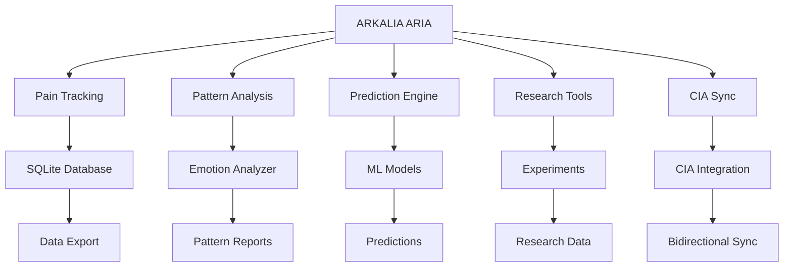

# ARKALIA ARIA

## Research Intelligence Assistant

### Laboratoire de recherche santé personnel

---

## Mission

ARKALIA ARIA est un assistant de recherche intelligent conçu pour transformer votre expérience de suivi de santé en un laboratoire personnel sophistiqué. Basé sur l'intelligence artificielle locale, ARIA analyse vos données de santé pour découvrir des patterns, prédire des crises et optimiser votre bien-être.

---

## Fonctionnalités Principales

### Suivi de Douleur Intelligent

- **Saisie ultra-rapide** : 3 questions seulement pour capturer l'essentiel
- **Analyse contextuelle** : Corrélation entre douleur, émotions et activités
- **Historique détaillé** : Visualisation des tendances temporelles

### Analyse de Patterns

- **Détection de corrélations** : Identification des déclencheurs récurrents
- **Analyse émotionnelle** : Évaluation du contexte psychologique
- **Rapports visuels** : Graphiques et métriques personnalisées

### Moteur de Prédiction

- **Prédiction de crises** : Anticipation des épisodes douloureux
- **Alertes précoces** : Notifications préventives
- **Recommandations personnalisées** : Conseils adaptés à votre profil

### Laboratoire Personnel

- **Expérimentations contrôlées** : Tests de nouvelles approches thérapeutiques
- **Métriques avancées** : Analyse statistique approfondie
- **Export anonymisé** : Partage sécurisé avec professionnels de santé

### Intégration CIA

- **Synchronisation bidirectionnelle** : Communication fluide avec ARKALIA CIA
- **Synchronisation automatique** : Périodique et configurable (60 min par défaut)
- **Mode psychologue** : Présentation anonymisée pour professionnels
- **Données unifiées** : Cohérence entre tous vos outils de santé
- **Pull depuis CIA** : Récupération RDV, médicaments, documents, contexte santé

### Intégration BBIA (Robot Compagnon)

- **Mode simulation** : Fonctionne sans robot physique (préparation état émotionnel)
- **Adaptation empathique** : Comportement robot basé sur douleur/stress/sommeil
- **4 endpoints API** : Status, connexion, envoi état émotionnel
- **Robot physique** : Activation complète prévue janvier 2026

---

## Démarrage Rapide

### Installation

```bash
# Cloner le projet
git clone https://github.com/arkalia-luna-system/arkalia-aria.git
cd arkalia-aria

# Créer l'environnement virtuel
python -m venv arkalia_aria_venv
source arkalia_aria_venv/bin/activate  # Linux/Mac
# ou
arkalia_aria_venv\Scripts\activate     # Windows

# Installer les dépendances
pip install -r requirements.txt

```

### Lancement

```bash
# Mode développement
uvicorn main:app --host 127.0.0.1 --port 8001 --reload

# Ou directement
python main.py

```

### Accès

- **API Documentation** : http://127.0.0.1:8001/docs
- **Interface Alternative** : http://127.0.0.1:8001/redoc
- **Statut de santé** : http://127.0.0.1:8001/health

---

## Architecture



---

## Sécurité et Confidentialité

- **Données locales** : Aucune donnée ne quitte votre appareil
- **Chiffrement** : Base de données SQLite sécurisée
- **Anonymisation** : Export pour professionnels sans données personnelles
- **Contrôle total** : Vous gardez la maîtrise de vos données

---

## Intégration avec ARKALIA CIA

ARKALIA ARIA fonctionne en parfaite harmonie avec ARKALIA CIA :

- **CIA** : Interface utilisateur et gestion des tâches
- **ARIA** : Analyse de données et recherche intelligente
- **Synchronisation** : Communication bidirectionnelle en temps réel

---

## Documentation

- [Guide Utilisateur](USER_GUIDE.md) - Comment utiliser ARIA au quotidien
- [Référence API](API_REFERENCE.md) - Documentation complète des endpoints
- [Guide Développeur](DEVELOPER_GUIDE.md) - Contribution et développement
- [Statut Projet](PROJECT_STATUS.md) - État actuel et roadmap

---

## Développement

### Tests

```bash
# Tests unitaires
pytest tests/ -v

# Tests avec couverture
pytest tests/ --cov=. --cov-report=html

# Tests d'intégration CIA/ARIA
python tests/integration/test_cia_aria_integration.py

```

### Qualité du Code

```bash
# Formatage
black .

# Linting
ruff check .

# Sécurité
bandit -r .
safety check

```

### Génération Documentation

```bash
# Construction locale
mkdocs serve

# Déploiement
mkdocs gh-deploy

```

---

## Roadmap

- [ ] **Interface Web** — Dashboard interactif
- [ ] **Mobile App** — Application Flutter native
- [ ] **IA Avancée** — Modèles ML plus sophistiqués
- [ ] **Intégrations** — Connexion avec d'autres outils de santé
- [ ] **Analytics** — Métriques de performance et d'usage

### Plan d'Action Détaillé

- [Workflow Professionnel](PROFESSIONAL_WORKFLOW.md) - Guide pour travailler efficacement
- [Statut Projet](PROJECT_STATUS.md) - État actuel et priorités
- [Checklist RGPD](SECURITY_RGPD_CHECKLIST.md) - Conformité et sécurité
- [Mentions Légales](LEGAL_MENTIONS.md) — Informations légales de l'entreprise
- [Politique de Confidentialité](PRIVACY_POLICY.md) — Protection des données personnelles
- [Conditions d'Utilisation](TERMS_OF_USE.md) — CGU de l'application
- [Politique de Cookies](COOKIES_POLICY.md) — Gestion des cookies
- [Contact DPO](DPO_CONTACT.md) — Délégué à la Protection des Données

### Référence Technique

- [Référence Technique](TECHNICAL_REFERENCE.md) - Guide technique complet
- [Guide Développeur](DEVELOPER_GUIDE.md) - Guide pour développeurs
- [Référence API](API_REFERENCE.md) - Documentation API complète

### Validation & Qualité

- [Checklist de Validation](VALIDATION_CHECKLIST.md) - Validation complète
- [Statut Modules](MODULE_STATUS.md) - État des modules
- [Guide Mobile](MOBILE_APP.md) - Documentation mobile

### Migration & Support

- [Guide Utilisateur](USER_GUIDE.md) - Guide utilisateur final

### Commandes & Références

- [Commandes Rapides](QUICK_COMMANDS.md) - Commandes essentielles
- [Guide Configuration](CONFIGURATION_GUIDE.md) - Configuration complète
- [Référence API](API_REFERENCE.md) - Documentation API complète
- [Guide Utilisateur](USER_GUIDE.md) - Guide utilisateur final

---

## Contribution

ARKALIA ARIA est un projet open source. Les contributions sont les bienvenues.

1. **Fork** le projet
2. **Créer** une branche feature (`git checkout -b feature/amazing-feature`)
3. **Commit** vos changements (`git commit -m 'Add amazing feature'`)
4. **Push** vers la branche (`git push origin feature/amazing-feature`)
5. **Ouvrir** une Pull Request

---

## Licence

Ce projet est sous licence MIT. Voir le fichier [LICENSE](https://github.com/arkalia-luna-system/Arkalia-aria/blob/main/LICENSE) pour plus de détails.

---

## Support

- **Issues** : [GitHub Issues](https://github.com/arkalia-luna-system/arkalia-aria/issues)
- **Discussions** : [GitHub Discussions](https://github.com/arkalia-luna-system/arkalia-aria/discussions)
- **Email** : <arkalia.luna.system@gmail.com>

---

**ARKALIA ARIA** — Transformez vos données de santé en insights intelligents

